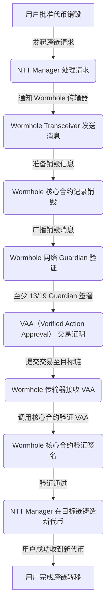

# Wormhole NTT Connect demo

This project sets up a Vite-React TypeScript application and integrates it with the Wormhole Connect SDK.

## Prerequisites

Ensure you have the following installed on your system:

- **Node.js** & **TypeScript**
- **npm** or **yarn**

## Setup

### 1. Clone the Repository

First, clone the repository to your local machine:

```bash
git clone https://github.com/wormhole-foundation/demo-ntt-connect.git
cd demo-ntt-connect
```

### 2. Download Dependencies

Make sure to install all required dependencies using `npm` or `yarn`:

```bash
# Using npm
npm install

# Or using yarn
yarn
```

### 3. Adjust WormholeConnectConfig

Adjust the `WormholeConnectConfig` in `App.tsx` based on the `deployment.json` file from your NTT deployment. This configuration is essential to ensure proper integration with your deployment environment.

### 4. Run the App

Finally, run your application:

```bash
yarn dev
```

or, if using npm:

```bash
npm run dev
```

### 5. Important Notes
   - Use a private RPC for mainnet, to prevent timeouts


