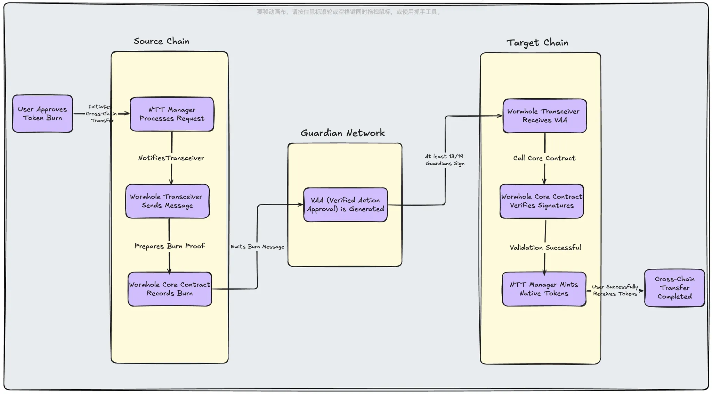
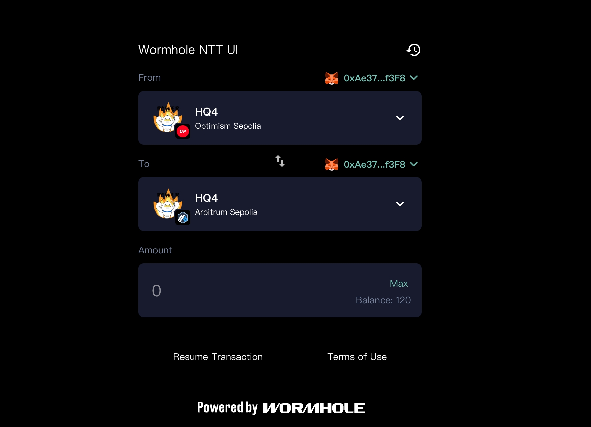

# Multichain Native Memecoin

这是一个基于 Wormhole NTT 框架的多链原生 Memecoin 项目，实现了跨链代币发行和跨链功能。本项目允许开发者发行一个基于 Burn-and-Mint 模式的原生代币 HackQuest(HQ)，并支持在 Solana、OptimismSepolia、ArbitrumSepolia 这三个区块链之间轻松转移。



想要深入学习该项目,请访问: https://arena.wormhole.com/zh-cn/courses/1bee7446-5ed5-8140-9ec4-e800f40a41bc

## 项目特点

- **原生代币支持**：每个链上的代币都是原生的，而不是包装代币，提供更好的用户体验和更低的交易成本
- **Burn-and-Mint 模式**：采用创新的销毁-铸造模式，确保跨链转移的安全性和可靠性
- **多链支持**：
  - Solana：高性能公链，支持快速交易和低费用
  - OptimismSepolia：Layer2 解决方案，提供以太坊兼容性和低成本
  - ArbitrumSepolia：另一个流行的 Layer2 网络，提供额外的扩展性选择
- **无缝跨链**：通过 Wormhole Protocol 实现安全可靠的跨链消息传递
- **用户友好**：提供直观的 Web 界面，支持钱包连接和跨链操作

## 项目结构


项目分为三个主要模块，每个模块负责不同的功能：

### 01-example-ntt-token
智能合约模块，实现了多链代币部署的核心功能：
- **PeerToken 合约**：实现了 Burn-and-Mint 模式的代币合约
  - 代币铸造功能
  - 代币销毁功能
  - 代币转账功能
  - 铸造权限管理
- **部署工具**：使用 Foundry 框架进行合约部署和交互
  - 支持多链部署
  - 提供代币铸造和查询功能
  - 环境变量配置

### 02-my-ntt-project
NTT (Native Token Transfer) 框架配置模块：
- **链配置**：配置支持的区块链网络
  - OptimismSepolia 配置
  - Solana 配置
  - ArbitrumSepolia 配置
- **跨链设置**：
  - 代币合约地址配置
  - 跨链模式设置（Burn-and-Mint）
  - 权限管理配置
- **部署管理**：
  - 配置同步（ntt pull/push）
  - 跨链参数验证
  - 部署状态管理

### 03-ntt-project-front
基于 Connect Widget 的前端界面：


- **用户界面**：
  - 钱包连接集成
  - 代币余额显示
  - 跨链转账操作
  - 交易状态追踪
- **技术实现**：
  - 基于 Vite + React + TypeScript
  - Wormhole Connect SDK 集成
  - 响应式设计
  - 实时状态更新


## 详细部署流程

### Step 1: 部署 ERC20 合约
首先，我们需要在 Optimism Sepolia 测试网上部署我们的代币合约。这个合约将作为我们在 Optimism 网络上的原生代币。

```bash
# 克隆示例代币项目
git clone https://github.com/wormhole-foundation/example-ntt-token.git
cd example-ntt-token

# 设置环境变量
export HACKQUEST=0xAe3759Ccc3E0877fFBb4d533a88Bf9AD0F2Df3F8  # 您的钱包地址
export OP_PRIVATE_KEY=your_private_key  # 您的私钥

# 部署代币合约
forge create --rpc-url "https://sepolia.optimism.io" \
  --private-key $OP_PRIVATE_KEY \
  --broadcast src/PeerToken.sol:PeerToken \
  --constructor-args "HackQuest" "HQ" $HACKQUEST $HACKQUEST

# 记录代币地址
export OP_TOKEN_ADDRESS=deployed_token_address
```

### Step 2: 铸造代币
部署完成后，我们需要铸造初始代币供应量。这里我们铸造 1000 枚代币。

```bash
# 铸造 1000 枚代币
cast send --private-key $OP_PRIVATE_KEY \
  --rpc-url "https://sepolia.optimism.io" \
  $OP_TOKEN_ADDRESS \
  "mint(address,uint256)" \
  $HACKQUEST \
  1000000000000000000000  # 1000 代币（18位小数）

# 查询余额确认铸造成功
cast call $OP_TOKEN_ADDRESS "balanceOf(address)(uint256)" $HACKQUEST \
  --rpc-url "https://sepolia.optimism.io"
```

### Step 3: 添加 Optimism Sepolia 链
现在我们需要配置 NTT 框架，首先添加 Optimism Sepolia 链。

```bash
# 初始化 NTT 项目
ntt new my-ntt-project
ntt init Testnet

# 设置环境变量
export ETH_PRIVATE_KEY=your_private_key
export OPTIMISMSEPOLIA_SCAN_API_KEY=your_api_key
export OP_TOKEN_ADDRESS=your_token_address

# 添加链配置
ntt add-chain OptimismSepolia --latest --mode burning --token $OP_TOKEN_ADDRESS
```

### Step 4: 修改代币铸造权限
为了确保跨链功能正常工作，我们需要将代币的铸造权限转移给 NTT Manager。

```bash
export NTT_MANAGER_ADDRESS=your_ntt_manager_address
cast send $OP_TOKEN_ADDRESS "setMinter(address)" $NTT_MANAGER_ADDRESS \
  --private-key $OP_PRIVATE_KEY \
  --rpc-url "https://sepolia.optimism.io"
```

### Step 5: 创建 Solana 账户
接下来，我们需要在 Solana 网络上创建必要的账户。

```bash
# 生成指定前缀的账户（用于支付交易费用）
solana-keygen grind --starts-with w:1

# 设置为默认账户
solana config set --keypair your_keypair.json

# 导出私钥（用于 NTT 配置）
ntt solana key-base58 <keypair>

# 获取测试币
solana airdrop 2
solana balance
```

### Step 6: 部署 SPL Token
在 Solana 上创建我们的代币。

```bash
# 创建代币
spl-token create-token

# 创建代币账户
spl-token create-account your_token_address
```

### Step 7: 设置代币元数据
为 Solana 代币设置元数据信息，包括名称、符号和图片。

```bash
# 克隆元数据项目
git clone https://github.com/wormhole-foundation/demo-metaplex-metadata
cd demo-metaplex-metadata

# 安装依赖
npm install

# 设置环境变量
export SOL_PRIVATE_KEY="your_private_key"

# 修改元数据信息
# 在配置文件中更新：
# - name: "HackQuest"
# - symbol: "HQ"
# - uri: "your_metadata_uri"

# 创建元数据
npm run create-metadata
```

### Step 8: 设置 Mint 权限
配置 Solana 代币的铸造权限，确保 NTT 框架可以控制代币铸造。

```bash
# 生成 NTT 程序账户（用于控制代币铸造）
solana-keygen grind --starts-with ntt:1

# 生成对应的 PDA 账户（程序派生地址）
ntt solana token-authority your_ntt_program_keypair

# 授权铸造权限给 NTT 程序
spl-token authorize your_token_address mint your_derived_pda
```

### Step 9: 添加 Solana 链
将 Solana 链添加到 NTT 配置中。

```bash
ntt add-chain Solana --latest --mode burning \
  --token your_token_address \
  --payer your_keypair.json \
  --program-key your_ntt_program_keypair.json
```

### Step 10: 配置 NTT
同步和更新 NTT 配置。

```bash
# 拉取最新配置
ntt pull

# 推送配置更新
ntt push --payer your_keypair.json
```

### Step 11: 部署前端界面
最后，部署用户界面，让用户可以方便地进行跨链操作。

```bash
# 克隆前端项目
git clone https://github.com/wormhole-foundation/demo-ntt-connect.git
cd demo-ntt-connect

# 安装依赖
npm install

# 启动开发服务器
npm run dev
```

